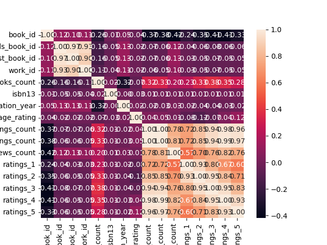

# Analysis Report
## Dataset Summary
The dataset contains information about 10,000 books and includes various attributes such as IDs, authors, publication details, language, and ratings. Here’s a summary of the key points:

### General Information:
- **Total Records:** 10,000 books.
- **Unique Authors:** 4,664.
- **Languages:** 25 different languages.
  
### Key Attributes:
- **Mean Original Publication Year:** Approximately 1982.
- **Average Book Rating:** Approximately 4.0 (on a scale where 5 is the highest).
- **Total Ratings Count (average):** About 54,000 ratings per book.
- **Total Ratings Count (max):** Some books have over 4 million ratings.
- **Total Text Reviews Count (average):** About 2,920 reviews per book.

### Ratings Distribution:
- Ratings are categorized into five tiers (1-5). The dataset includes counts for each rating:
  - Rating 1: Mean = 1,346
  - Rating 2: Mean = 3111
  - Rating 3: Mean = 11,476
  - Rating 4: Mean = 19,957
  - Rating 5: Mean = 23,789

### Missing Values:
- **ISBN:** 700 entries missing.
- **ISBN13:** 585 entries missing.
- **Original Publication Year:** 21 entries missing.
- **Original Title:** 585 entries missing.
- **Language Code:** 1,084 entries missing.

Overall, this dataset offers a comprehensive view of various books, focusing on their ratings and relevant metadata, though it does contain some missing information in key areas like ISBN and publication details. The dataset is likely useful for analysis concerning book popularity, author performance, and publication trends over time.

## Visualizations

