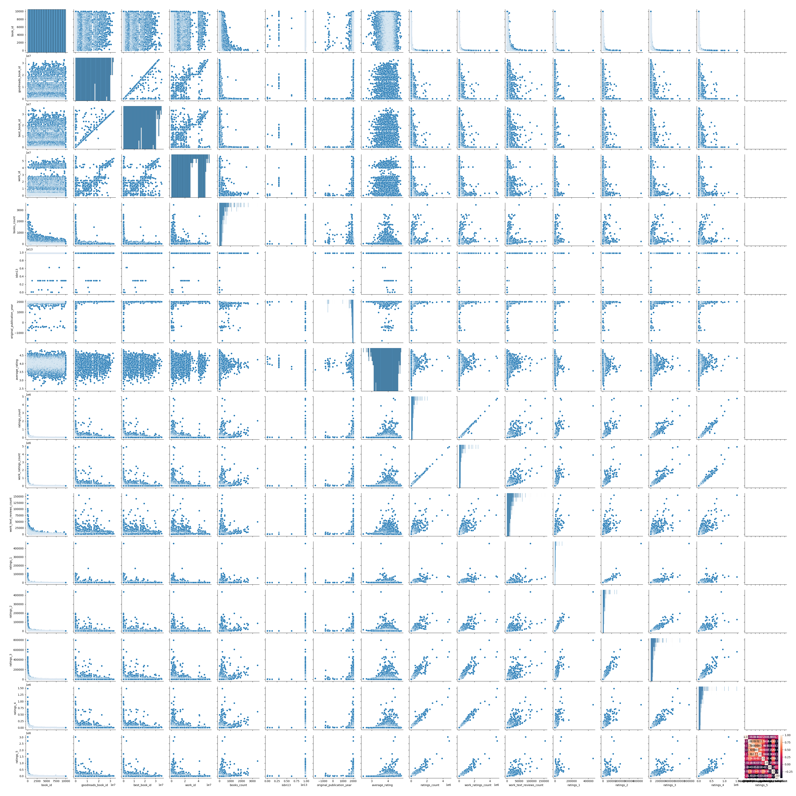

# Analysis Report
## Dataset Summary
The dataset contains 2,363 entries across 165 unique countries, spanning the years from 2005 to 2023. The following key metrics are included:

1. **Life Ladder**: A subjective measure of well-being, with values ranging from 1.281 to 8.019, averaging around 5.48.
2. **Log GDP per capita**: Reflecting economic status, the values range from 5.527 to 11.676, with a mean of approximately 9.40.
3. **Social Support**: Measured from 0.228 to 0.987, with an average of 0.81, indicating the level of support individuals feel they have.
4. **Healthy Life Expectancy at Birth**: This ranges from 6.72 to 74.6 years, with a mean of about 63.4 years.
5. **Freedom to Make Life Choices**: The values range from 6.72 to 74.6, with a mean score around 63.4.
6. **Generosity**: Values vary from -0.34 to 0.985, averaging near 0.75.
7. **Perceptions of Corruption**: This metric has a range from 0.035 to 0.983, with a mean of approximately 0.74.
8. **Positive Affect**: Scores range from 0.179 to 0.884, averaging around 0.65.
9. **Negative Affect**: This metric ranges from 0.083 to 0.705, with an average score of about 0.27.

### Missing Values:
- There are no missing values for country names or years.
- Log GDP per capita has 28 missing values.
- Social support has 13 missing values.
- Healthy life expectancy has 63 missing values.
- Freedom to make life choices has 36 missing values.
- Generosity has 81 missing values.
- Perceptions of corruption has 125 missing values.
- Positive affect has 24 missing values.
- Negative affect has 16 missing values.

Overall, the dataset provides a comprehensive overview of various indicators of well-being, economic status, and social conditions across different countries and years.

## Visualizations

