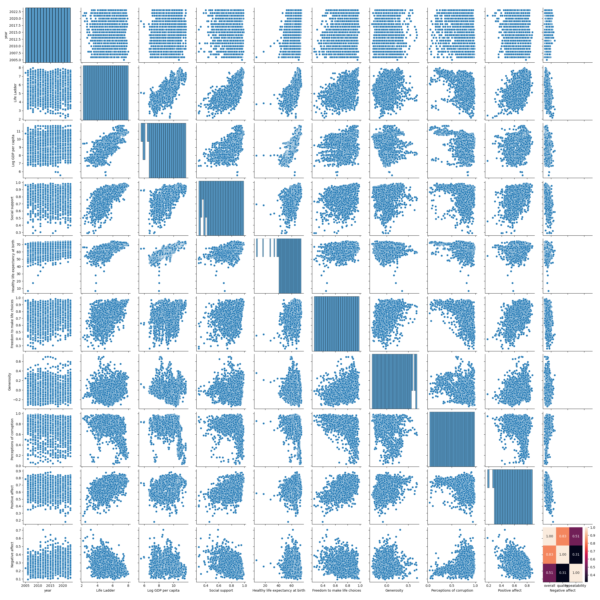
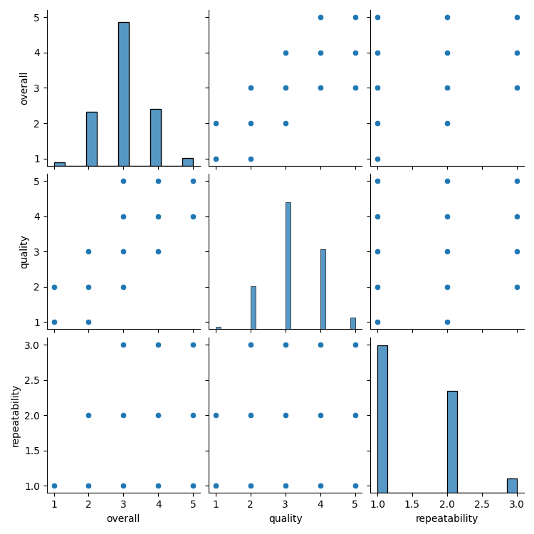

# Analysis Report
## Dataset Summary
The dataset contains 2,652 entries and provides information across various attributes such as dates, languages, types, titles, authors, and ratings. Here’s a summary of the key aspects:

**General Overview:**
- **Total Entries:** 2,652
- **Date Range:** Contains 2,055 unique dates.
- **Languages:** 11 distinct languages.
- **Types:** 8 different content types (e.g., movie).
- **Titles:** 2,312 unique titles.

**Most Common Values:**
- **Most Frequent Date:** 21-May-06 (appears 8 times).
- **Most Common Language:** English (appears 1,306 times).
- **Most Common Type:** Movie (appears 2,211 times).
- **Most Frequent Title:** Kanda Naal Mudhal (appears 9 times).
- **Most Common Author:** Kiefer Sutherland (appears 48 times).

**Ratings:**
- **Overall Rating:** Mean score is approximately 3.05, with a standard deviation of 0.76. Ratings range from a minimum of 1 to a maximum of 5.
- **Quality Rating:** Mean score is approximately 3.21, with a standard deviation of 0.80, also ranging from 1 to 5.
- **Repeatability:** Mean score is approximately 1.49, with a standard deviation of 0.60, with values spanning from 1 to 3.

**Interquartile Ranges:**
- 25th Percentile: Overall rating of 3, Quality rating of 3, Repeatability of 1.
- 50th Percentile (Median): Overall rating of 3, Quality rating of 3, Repeatability of 1.
- 75th Percentile: Overall rating of 3, Quality rating of 4, Repeatability of 2.

**Missing Values:**
- **Date:** 99 missing entries.
- **Author ('by'):** 262 missing entries.
- All other fields (language, type, title, overall, quality, repeatability) have no missing values.

Overall, the dataset is fairly comprehensive, with specific trends in language and type distribution, while some entries lack information on the author. It features a moderate range of ratings that suggest variability in overall perceptions of the content represented in the dataset.

## Visualizations

